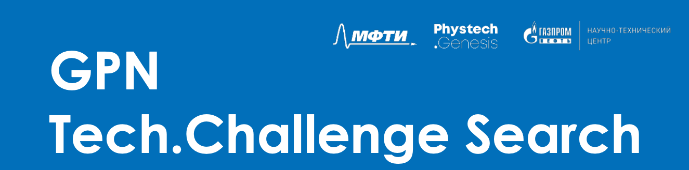
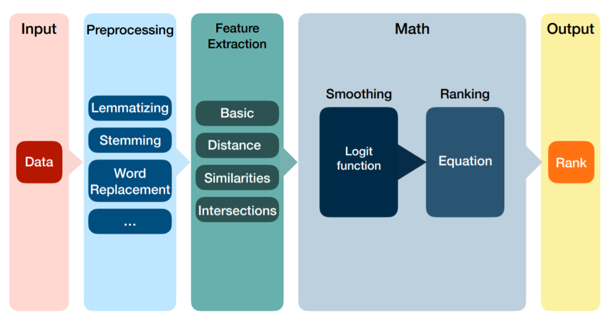
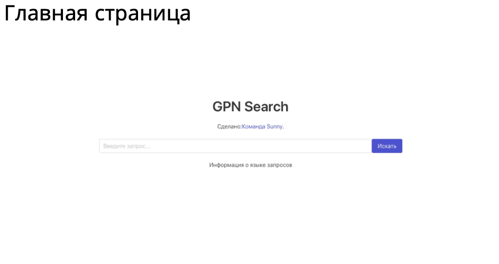
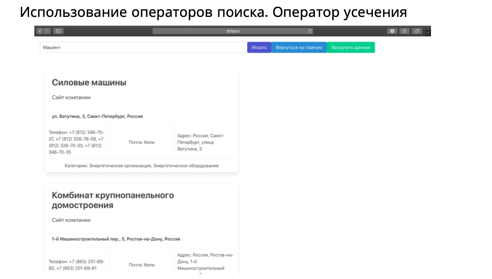

# GPN Tech.Challenge Search

### [Сертификат участника](att/Санни_Кирилл_Козлитин.pdf)

Хакатон в цифрах:
- **270 регистраций**
- **13 команд**
- **54 участника**

Команда: // **Санни** // 
[Презентация решения](att/presentation.pdf)

### Задача хакатона
**Необходимо разработать поисковый движок, осуществляющий поиск технологических компаний по открытым источникам по заданным критериям**

📌 **Примеры критериев поиска**

- ***отрасль*** (в рамках хакатона можно ограничиться следующим сферами: Энергетика, Добыча полезных ископаемых, Строительство, Металлургия, Химическая и нефтехимическая промышленность, Машиностроение и металлообработка, Производство строительных материалов и т.д.);
- ***сфера применения*** (Геологоразведочные работы, Геология и разработка месторождений нефти и газа, Добыча нефти и газа, Нефтегазосервис (Upstream), Транспорт и хранение нефти и газа (Midstream), Энергоэффективность, Нефтегазопереработка, нефтегазохимия, СПГ, сбыт (Downstream) и т.д.);
- ***конкретные технологии*** (бурение скважин, исследование скважин, методы увеличения нефтеотдачи, методы интенсификация добычи и т.д.), оборудование и материалы (насосно-компрессорные трубы, обсадные трубы, ЭЦН, жидкости ГРП, проппант, композитные материалы и т.д.), ***программное обеспечение;***
- ***ваши предложения*** по результатам бизнес-анализа.

### Переформулирование в задачу DS:
Необходимо реализовать систему ранжирования результатов поиска. От более релевантных - к менее.

## Реализация

Наша команда состояла из 4 человек:  

👨‍💻 BackEnd/Frontend-разработчик  
👩‍💻 BackEnd-разработчик  
👨‍🔧 DS-инженер (я)  
👨‍💼 Бизнес-аналитик  

Нами был выбран следующий алгоритм реализации проекта: Данные парсятся из открытых источников (Яндекс.Карты). Вытаскиваются ключевые для задачи данные о компаниях:
- Название компании
- Области деятельности
- Телефон
- Адрес

Далее, данные ранжируются с помощью ML-алгоритмов и пользователь получает итоговую поисковую выдачу. 

Как был реализован Backend:

Схема реализации DS-части:

### Описание работы:

Инструменты:
- pandas
- gensim
- nltk
- pymystem3
- sklearn
- scipy

**Тип задачи:** Классическая задача ранжирования
**Проблематика:** Неразмеченные данные

Существует несколько популярных подходов к решению задач ранжирования. Но, к сожалению, люьой их них подразумевает наличие разметки. Поэтому, я решил зайти с другой стороны. В целом, количество результатов выдачи не так чтобы велико. Количество результатов первичной выдачи редко превышает 50 экземпляров. Можно сначала отобрать только те компании, которые явно соответствуют переданным в запросе ограничениям. А уже на следующем шаге выполнить ранжирование простой математической формулой. 

Итоговая схема реализации выглядит следующим образом: 
- Входные данные предобрабатываются
- Слова из поля "область деятельности" проходят лемматизацию и формируют bag of words
- Запрос и "область деятельности" переводятся в векторное пространство с помощью векторайзеров библеотеки sklearn и gensim
- Вычисляется косинусное расстояние между между векторами. Расстояние переводится в меру близости.
- Помимо этого, проверяется наличие вхождения слов из переданного запроса в названии компаний 
- * Опционально. При наличии данных о количестве комментариев, рейтинге, описании компании, вычисляются дополнительные фичи.
- Проверяется соответсвие переданным ограничениям. В частности, если пользователя интересует определенный город, проверяется адрес компании. В первую очередь будут выводиться компании из этого города.
- Далее вычисленные величины сводятся в итоговый фрейм. Часть данных сглаживается логитом и с помощью selfmade формулы вычисляется итоговый рейтинг
- На выходе получаем отсортированный в порядке релевантности список индексов компаний.

Результат командной работы:

